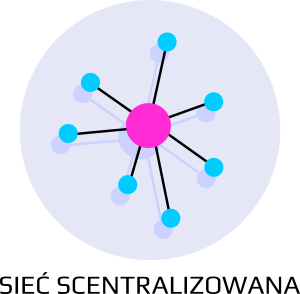
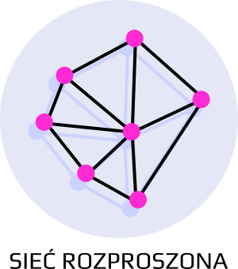
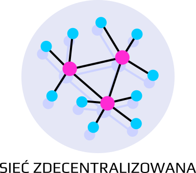

+++
title = "O projekcie"
template = "section.html"
+++

Projekt na który właśnie trafiłeś to zbiór porad dotyczących **uruchomienia własnych** lub **korzystania z już istniejących** usług zdecentralizowanych. Zacznijmy jednak od tego czym są usługi zdecentralizowane i dlaczego warto się nimi zainteresować.

## Sieci scentralizowane

Internet jaki znasz składa się głównie z usług scentralizowanych, w których użytkownicy korzystają z platform zarządzanych przez pojedynczą firmę/korporację. Są to głównie **rozwiązania zamknięte**, gdzie kod źródłowy jest **ukryty** i **chroniony** jako własność intelektualna. Nie mamy więc pewności co tak na prawdę dzieje się z danymi trafiającymi do takiej platformy i jak dokładnie są wykorzystywane. Nie mamy nad nimi kontroli. Często **nie mamy kontroli** też nad zasadami, jakimi kieruje się dana platforma co skutkować może **dowolnie aplikowaną cenzurą** czy wybiórczo stosowanymi regułami. Systemy scentralizowane są też bardzo **wrażliwe na awarie**, ponieważ awaria w takim systemie można uniemożliwić korzystanie z niego wszystkim użytkownikom.

Z takimi sieciami mamy do czynienia na co dzień korzystając w wyszukiwarki **Google**, podpatrując znajomych na **Facebook**u, oglądający film na **YouTube** czy słuchając muzyki na **Spotify**.

## Sieci rozproszone

Sieci rozproszone to dokładne **przeciwieństwo centralizacji**. W tych sieciach **każdy węzeł jest tak samo ważny** (lub nie ważny). Strata kilku węzłów nie wpływa znacząco na działanie całej sieci. Zazwyczaj węzły takiej sieci porozumiewają się za pomocą ustalonego, **otwartego protokołu komunikacji** co pozwala na samodzielne tworzenie programów, które potrafią się komunikować z pozostałymi uczestnikami sieci.

Dla lepszego zobrazowania zasad działania sieci rozproszonej wyobraźmy sobie serwis YouTube zaprojektowany jako sieć rozproszona. Każdy z nas uruchamiałby aplikację YouTube będącą **węzłem** takiej sieci i za jej pomocą oglądał lub udostępniał innym filmy z własnego dysku. Jeżeli jednemu z wideoblogerów zepsułby się komputer wówczas widzowie straciliby możliwość oglądania jego filmów. Nie wpłynęło by to jednak na dostępność filmów innych autorów o ile tylko ich węzły sieci pozostawałyby cały czas dostępne.

Przykładami sieci rozproszonych są **sieci blockchainowe** np. **Bitcoin** czy sieć **BitTorrent**.

## Sieci zdecentralizowane

Kompromisem pomiędzy oddawaniem wszystkiego w ręce dużych korporacji (sieci scentralizowane) a koniecznością samodzielnego stawiania własnego mini serwera (sieci rozproszone) są sieci zdecentralizowane. Ich cechą charakterystyczną jest posiadanie dużej ilości małych serwerów, do których podłączają się klienci, najczęściej lokalni. Serwery potrafią komunikować się ze sobą za pomocą otwartego protokołu komunikacji, znany jest również protokół komunikacji klienta z serwerem.

Kontynuując porównanie do serwisu YouTube jego zdecentralizowana wersja mogła by być zbudowana z **wielu serwerów** miejskich, które przechowywały by **lokalne** nagrania. Wideo-blogerzy z Gdańska wrzucali by swoje nagrania na lokalny Gdański serwer a wideo-blogerzy z Krakowa nagrania trzymaliby na serwerze Krakowskim, dzięki czemu nikt nie musiałby samodzielnie udostępniać filmów z własnego dysku (tak jak w przypadku sieci rozproszonych). Jednocześnie z uwagi na zdolność serwerów do rozmawiania pomiędzy sobą klienci dowolnego z nich nadal mieliby dostęp do filmów z znajdujących się na dowolnym innym serwerze. Awaria serwera Gdańskiego co prawda uniemożliwiłaby oglądanie filmów "z obszaru Gdańskiego" jednak filmy z pozostałych regionów nadal byłyby dostępne.

Dobrze wszystkim znanym przykładem sieci rozproszonej jest **system poczty elektronicznej**. Mamy do dyspozycji wiele serwerów poczty elektronicznej, które komunikują się pomiędzy sobą za pomocą otwartego protokołu, mamy też wiele aplikacji klienckich, które również komunikują się z "lokalnymi serwerami" za pomocą otwartego protokołu. Awaria serwerów **onet.pl**, chociaż uniemożliwa odbieranie wiadomości jego użytkownikom to jednak nie wpływa na komunikację pomiędzy pozostałymi serwerami. Nadal użytkownicy innych serwerów mogą wysyłać e-maile z np. z serwerów **wp.pl** do serwerów **gmail.com**.

Decentralizacja nie tylko **ogranicza zasięg awarii** ale również przekazuje zarządzanie danymi do serwerów lokalnych. Pozostając w konwencji poczty elektronicznej to użytkownicy sami podejmują decyzję na jakich serwerach założą swoje konto pocztowe. Każdy serwer ma swój własny regulamin, cennik usług czy zespół administracyjny. Jeżeli nie ufamy administratorom darmowego serwera **X** zawsze możemy założyć konto w bardziej zaufanym serwisie **Y** lub nawet samemu czy z pomocą znajomych założyć własny serwer.

Decentralizacja **oddaje władzę w ręce małych grup** i pozwala im **kierować się własnymi zasadami**.

Jeżeli zachęcił Cię ten wstęp to teraz pora przyjrzeć się usługom zdecentralizowanym, [z których możesz skorzystać już od zaraz](uzytkownicy).

Jeżeli posiadasz zdolności techniczne, może zainteresuje Cię możliwość uruchomienia [własnej usługi zdecentralizowanej](administratorzy) i zaproszenia do niej swoich znajomych?

